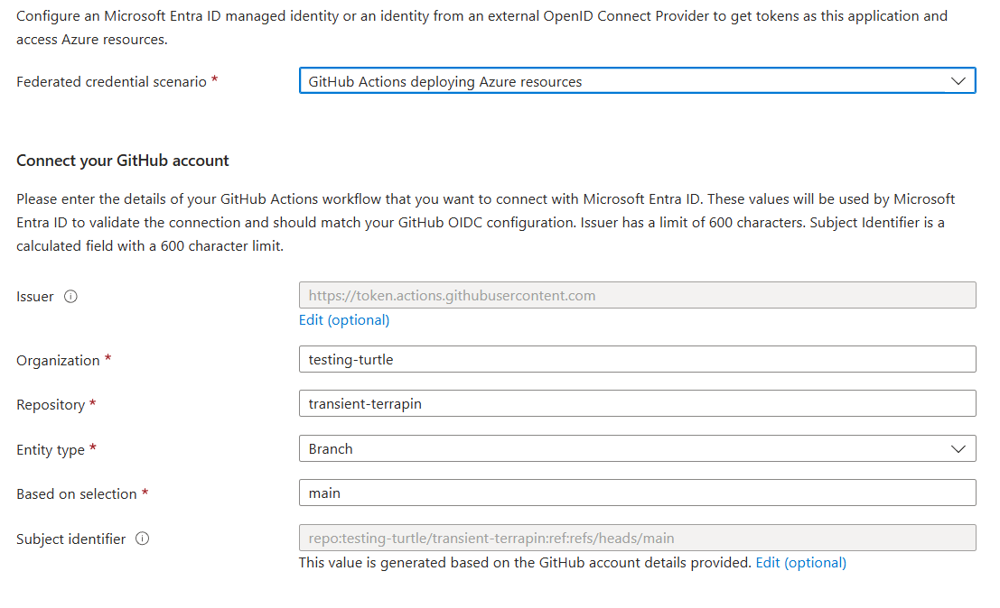
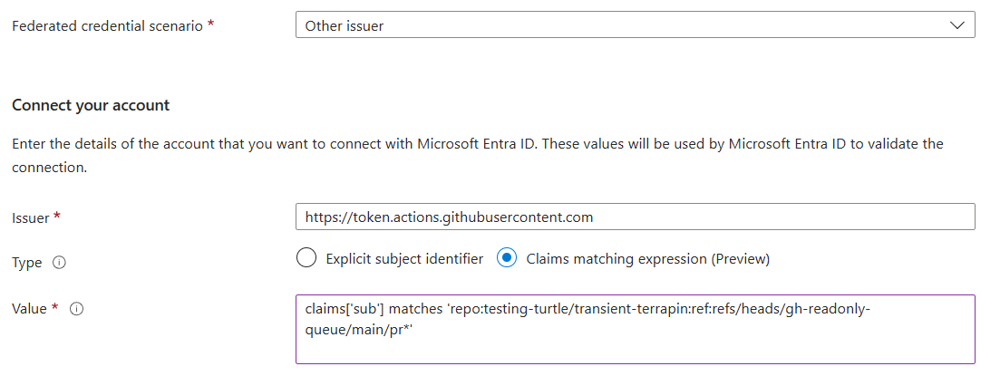

## Introduction

I often have GitHub workflows that deploy resources to Azure.
In the past, I have created a service principal and use the client secret to authenticate to Azure.
This isn't ideal as if the client secret is leaked then it can be used to access the Azure resources.
Additionally, the client secret needs to be rotated periodically which can be a pain (yeah, I'm lazy!).

A while back several colleagues pushed me to start using [federated credentials](https://docs.github.com/en/actions/security-for-github-actions/security-hardening-your-deployments/configuring-openid-connect-in-azure).
Initially I pushed back as it was another thing to learn and I had other things I needed to get done.
When I finally got around to it, I found that it was easier than I expected and I'm gradually migrating all of my projects to use federated credentials.

With federated credentials, you can use Azure Entra ID to authenticate to Azure without needing to manage client secrets.
Instead, your GitHub workflow gets a token from GitHub and then uses that token to get an Azure Entra ID token.
This flow is shown in the [Entra ID docs](https://learn.microsoft.com/en-gb/entra/workload-id/workload-identity-federation).


## Merge Queue - The Challenge

When configuring federated credentials, you need to set up a trust relationship between GitHub and Azure.
As part of this, you set up the contexts that GitHub will use to authenticate to Azure.
For example, the screenshot below shows the configuration for the `main` branch of a repository.




To use these credentials in a GitHub workflow, you can use the [azure/login](https://github.com/azure/login) action.
This action needs the client ID of the Azure Entra ID application and the tenant ID of the Azure Entra ID tenant, e.g. from repo variables/secrets.

When the action runs it uses the token from GitHub to get a token from Azure Entra ID.
It is able to do this because of the federated credentials configuration above.

If you are using the same workflow for multiple contexts, for example pushing to `main` and PRs to `main`, then you need to set up the federated credentials for each context.
This can be useful, for example if you only want to allow access to your Azure resources from the `main` branch and not from PRs. Or if you want to use different Azure Entra ID identities for different contexts and grant different access to each identity.

At the time of writing, the available options for the entity type in Entra ID are `Environment`, `Branch`, `PullRequest`, and `Tag`.
Note the lack of `MergeQueue` as an option!
If you trying running a workflow that uses federated credentials as part of a merge queue run you will get an error similar to the one below.

```
Error: AADSTS7002131: No matching federated identity record found for presented assertion subject 'repo:testing-turtle/transient-terrapin:ref:refs/heads/gh-readonly-queue/main/pr-13-7b1f002b00ec25a5facc43e470ef7dfe6d32f300' or no federated identity credential expression matched. Please check your federated identity credential Subject, Expression, Audience and Issuer against the presented assertion. https://learn.microsoft.com/entra/workload-id/workload-identity-federation
```


## Merge Queue - The workaround

While the configuration UI in Entra ID gives a guided flow for GitHub, it doesn't currently support merge queues.
Fortunately, it gives us an escape hatch - we can pick the "Other issuer" option from the scenario dropdown and get more control over the configuration.

When using the GitHub token to get the Entra ID token, the token has a subject claim that varies depending on the context.
The error message above shows us the subject claim that is being presented to Entra ID.
From this we can see that the subject claim is in the format `repo:{owner}/{repo}:ref:refs/heads/{branch}/pr-{number}-{id}`.

Since the subject claim varies based on the PR number and some other ID value that changes, we can't use standard claim matching.
Instead, we need to use the preview of claim expressions to match the subject claim.

To enable merge queue runs with federated credentials, we can set the issuer to `https://token.actions.githubusercontent.com` and the claim expression to `claims['sub'] matches 'repo:<{owner}>/{repo}:ref:refs/heads/gh-readonly-queue/{branch}/pr*'` (note that the values for `{owner}`, `{repo}`, and `{branch}` need to be replaced with the actual values for your repository).
This is shown in the screenshot below.




## Summary

Federated credentials seem like a great way to authenticate to Azure from GitHub workflows.
They are better for locking down the access to Azure resources and avoid the need to manage client secrets.

Currently, the configuration experience for federated credentials with GitHub merge queues needs a workaround, but hopefully this will be improved in the future.
