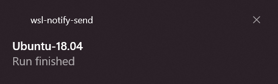
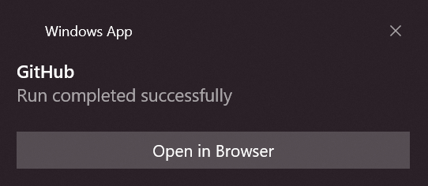
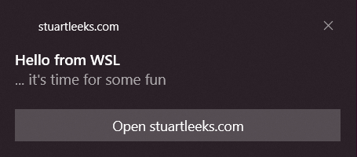
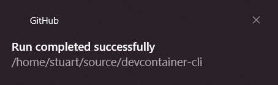

## Introduction

In the [last post]() we saw how to create a drop-in replacement for `notify-send`. This allowed us to take a script that used `notify-send` and run it without modification. In this post, we'll take a look at how we can update that script to take better advantage of Windows notifications.

At the end of the last post, the notification was fairly generic as shown below:



In this post, we'll update the script to indicate whether the run finished successfully or not, change the title to "GitHub", and include an "Open in Browser" link:



If you just want to grab the scripts then [skip to the bottom](#show-me-the-scripts), otherwise continue reading...


## Introducing toast

The `notify-send` replacement from the last post was built using the [go-toast/toast](https://github.com/go-toast/toast) golang package. That repo also includes a handy `toast` CLI. I've create a fork with an updated version that can be run from anywhere twithout displaying a console window and will be using that in this post (see [stuartleeks/toast](https://github.com/stuartleeks/toast)).

As previously, I've downloaded `toast.exe` (grab the [latest release](https://github.com/stuartleeks/toast/releases/latest)), popped it in my Windows `PATH`. Then I add an alias so that I can call it without the `.exe` extension: `alias toast=toast.exe`.

With this done, I can run `toast --app-id stuartleeks.com --title "Hello from WSL" --message "... it's time for some fun" --action "Open stuartleeks.com" --action-arg https://stuartleeks.com`. As you can see in the image below, this allows us to control the app name, title, content, and add an "Open stuartleeks.com" action.



## Reworking `ghrun`

In the last post, we used the following `ghrun` alias to watch the GitHub workflow and send a notification:

```bash
alias ghrun="gh run list | grep \$(git branch --show-current) | cut -d$'\t' -f 8 | xargs gh run watch && notify-send 'Run finished'"
```

To achieve the goals above, we need to capture some extra information before raising the notification. To make this easier, I'm going to break this out as a bash script rather than trying to do it all in a single line.

It's also worth noting that there are some parts of this script that could be simplified if the `gh run view` command could return JSON that we could parse (see [this GitHub issue](https://github.com/cli/cli/issues/3477) tracking that feature). A first attempt at `ghrun.sh` is shown below:

```bash
#!/bin/bash
set -e

# Get the latest run for the current branch 
# (update to use JSON output once implemented - see https://github.com/cli/cli/issues/3477)
run_id=$(gh run list | grep $(git rev-parse --abbrev-ref HEAD) | cut -d$'\t' -f 8 | head -n 1)

# Watch the run progress
gh run watch $run_id

# get the run status
exit_code=$(gh run view $run_id --exit-status > /dev/null; echo $?)

if [[ $exit_code == "0" ]]; then
    title="Run completed successfully"
else
    title="Run completed with exit code $exit_code"
fi

toast.exe \
    --app-id "GitHub" \
    --title "$title" \
    --message "$PWD" 
```

In this script we split out getting the `run_id` from the `gh run watch` command. Once the run completes, we use the `gh run view` command with the `--exit-status` switch. This gives a zero return code on successful runs and non-zero on failed runs, so we can use this to customise the notification message text.

Finally, the script calls toast using the working directory as the message:



## Capturing the run URL

The last step is to add the "Open in Browser" link. For this we need to get the URL for the run. The `gh run view` command takes a `--web` switch that opens the browser, but currently (again, pending [this issue](https://github.com/cli/cli/issues/3477)) there isn't an easy way to get the URL that it opens.

Constraints breed creativity, so it's time to get creative!

The `gh` CLI checks the `BROWSER` environment variable to determine which browser to use to open the link, appending the link to open as an argument. With this thought in mind, I created a `save-args.sh` script that takes a filename as its first argument and then writes the subsequent arguments (one per line) to the specified filename.

```bash
#!/bin/bash

#
# Usage:
#   save-args.sh <filename> arg1 arg2 ...
#
# save-args will write arg1, arg2, ... to <filename> (one arg per line)
#

filename=$1

if [[ -z "$1" ]]; then
  echo "Need a minimum of one argument specifying the output filename"
  exit 1
fi

if [[ -f "$filename" ]]; then
  rm "$filename"
fi

touch "$filename"
for i in "${@:2}"; do
  echo "$i" >> "$filename"
done
```

Save the above script as `save-args.sh` and make it executable (`chmod +x save-args.sh`). With this, we can now use `save-args.sh` as our fake browser:

```bash
# Update the path below and set run_id to a run ID (find runs with "gh run list")
$ BROWSER="/path/to/save-args.sh /tmp/browser-url" gh run view $run_id -w
Opening github.com/stuartleeks/devcontainer-cli/actions/runs/868183587 in your browser.
$ cat /tmp/browser-url
https://github.com/stuartleeks/devcontainer-cli/actions/runs/868183587
$
```

As the above output shows, `gh run view` passes the run URL to our fake browser (`save-args.sh`) which saves it to the file we tell it to.

## Adding the "Open in Browser" link

We can use the `save-args.sh` technique above in the `ghrun.sh` script to get the run URL to include as an action in the desktop notification. The updated `ghrun.sh` is shown below.

```bash
#!/bin/bash
set -e

dir="$( cd "$( dirname "${BASH_SOURCE[0]}" )" >/dev/null 2>&1 && pwd )"

# Get the latest run for the current branch 
# (update to use JSON output once implemented - see https://github.com/cli/cli/issues/3477)
run_id=$(gh run list | grep $(git rev-parse --abbrev-ref HEAD) | cut -d$'\t' -f 8 | head -n 1)

# Watch the run progress
gh run watch $run_id

# Create a temp file to capture the url in via a fake browser
# (update to use JSON output once implemented - see https://github.com/cli/cli/issues/3477)
temp_filename=$(mktemp)
# clean up the temp file on exit
function finish {
  rm "$temp_filename"
}
trap finish EXIT

# Use fake browser to capture run url
exit_code=$(BROWSER="$dir/save-args.sh \"$temp_filename\"" gh run view $run_id --web --exit-status > /dev/null; echo $?)
run_url=$(cat "$temp_filename" | head -n 1)

if [[ $exit_code == "0" ]]; then
    title="Run completed successfully"
else
    title="Run completed with exit code $exit_code"
fi

toast.exe \
    --app-id "GitHub" \
    --title "$title" \
    --message "$PWD" \
    --action "Open browser" --action-arg "$run_url"
```

Note that this script assumes that the `save-args.sh` script is in the same directory (note how it captures the `$dir` at the start and uses this to reference `save-args.sh` in the call to `gh run view`).

The script uses `mktemp` to create a temporary file. We capture the output of `mktemp`, which is the full path to the created file, and use this as the file for `save-args.sh` to write to. After creating the file we create a `finish` function that deletes the file and use `trap` to execute that when the script exits (even if it exits due to an error) to avoid leaving temporary files around.

And with that, we're done! The script can definitely be simplified once [`gh run view` supports JSON output](https://github.com/cli/cli/issues/3477), but with a little creativity we didn't have to wait 😀.

<a id="show-me-the-scripts" />

## Show me the scripts! 

If you want to get started with the `ghrun` alias:

- Grab the scripts from [this gist](https://gist.github.com/stuartleeks/1d579f042fac3a4cdb6663ca10dc97de)
- Download `toast.exe` from https://github.com/stuartleeks/toast/releases/latest and place in your Windows `PATH`
- Save `ghrun.sh` and `save-args.sh` to your system and make executable (`chmod +x ghrun.sh` etc)
- Add an alias `alias ghrun=/path/to/ghrun.sh`

With that done, create a PR against a GitHub repo with workflows configured and run `ghrun` to enjoy an auto-updating view of the workflow progress in your terminal and a Windows desktop notification when the workflow completes (to bring you back to the task if you got distracted!).


*P.S. If you liked this, you may also like my book "WSL 2: Tips, Tricks and Techniques" which covers tips for working with WSL 2, Windows Terminal, VS Code dev containers and more <https://wsl.tips/book> :-)*
